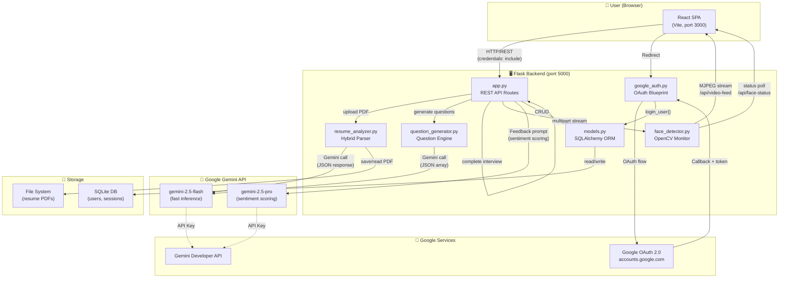
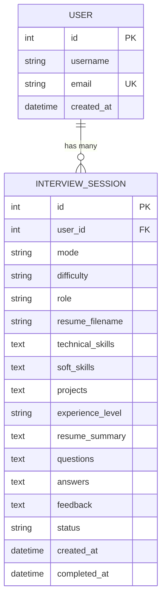

# LLM-Powered Cognitive Interview Assistant — Project Details

> A detailed technical documentation of the project architecture, workflow, components, LLM integration, and sentiment analysis pipeline.

---

## Table of Contents

1. [Project Overview](#1-project-overview)
2. [Technology Stack](#2-technology-stack)
3. [File Structure](#3-file-structure)
4. [Architecture Diagram](#4-architecture-diagram)
5. [Complete Workflow Diagram](#5-complete-workflow-diagram)
6. [Backend Components](#6-backend-components)
   - [app.py — Flask API Server](#61-apppy--flask-api-server)
   - [gemini.py — LLM Client & Sentiment Analyzer](#62-geminipy--llm-client--sentiment-analyzer)
   - [resume_analyzer.py — Hybrid Resume Parser](#63-resume_analyzerpy--hybrid-resume-parser)
   - [question_generator.py — Dynamic Question Engine](#64-question_generatorpy--dynamic-question-engine)
   - [face_detector.py — OpenCV Face Monitor](#65-face_detectorpy--opencv-face-monitor)
   - [google_auth.py — OAuth Authentication](#66-google_authpy--oauth-authentication)
   - [models.py — Database Schema](#67-modelspy--database-schema)
7. [Frontend Pages & Components](#7-frontend-pages--components)
   - [App.jsx — Root Router](#71-appjsx--root-router)
   - [LoginScreen.jsx — Landing Page](#72-loginscreenjsx--landing-page)
   - [Dashboard.jsx — Main Controller](#73-dashboardjsx--main-controller)
   - [ResumeUpload.jsx — Resume Upload Page](#74-resumeuploadjsx--resume-upload-page)
   - [RoleSelection.jsx — Role-Based Mode Page](#75-roleselectionjsx--role-based-mode-page)
   - [InterviewSession.jsx — Live Interview Page](#76-interviewsessionjsx--live-interview-page)
   - [FeedbackDashboard.jsx — Results Page](#77-feedbackdashboardjsx--results-page)
   - [FaceDetectionWidget.jsx — Proctoring Overlay](#78-facedetectionwidgetjsx--proctoring-overlay)
8. [LLM Integration — How Gemini is Used](#8-llm-integration--how-gemini-is-used)
9. [Sentiment Analysis Pipeline](#9-sentiment-analysis-pipeline)
10. [Data Flow: API Endpoints](#10-data-flow-api-endpoints)
11. [Database Design](#11-database-design)
12. [Security & Authentication](#12-security--authentication)

---

## 1. Project Overview

**LLM-Powered Cognitive Interview Assistant** is an AI-driven mock interview preparation platform built on top of Google Gemini. The core idea is to use a Large Language Model (LLM) to:

- **Analyze a candidate's resume** and extract skills, projects, and experience level.
- **Generate personalized interview questions** tailored to the candidate's background or target role.
- **Evaluate written/spoken answers** using a Gemini-powered sentiment and competency analyzer.
- **Provide structured feedback** with scores across HR, Technical, and Cultural dimensions.

The web interface is a single-page React application that communicates with a Flask backend. The Flask backend acts as a middleware layer between the user and the Gemini API, handling all LLM calls, resume parsing, session persistence, and user authentication.

> This is **not a full-stack product application** — it is an **LLM-centric project** where the LLM is the core engine, and the webpage is a lightweight interaction layer to drive it.

---

## 2. Technology Stack

| Layer | Technology | Purpose |
|---|---|---|
| LLM Engine | **Google Gemini 2.5 Flash / Pro** | Question generation, resume analysis, answer feedback, sentiment scoring |
| Backend | **Python 3 + Flask** | REST API, session management, orchestrating LLM calls |
| Database | **SQLite + SQLAlchemy** | Storing users, interview sessions, questions, answers, feedback |
| Authentication | **Google OAuth 2.0 + Flask-Login** | Secure user identity via Google accounts |
| PDF Parsing | **pdfplumber + PyPDF2 (fallback)** | Extracting text from resume PDFs |
| Face Detection | **OpenCV (cv2)** | Real-time Haar Cascade face monitoring during interviews |
| Frontend | **React (Vite)** | SPA for user interaction |
| Voice Input | **Web Speech API** | Browser-native speech recognition for voice answers |
| Styling | **Vanilla CSS** | Custom design system |

---

## 3. File Structure

```
Final_Year_Project/
│
├── backend/                        # All Python server-side logic
│   ├── app.py                      # Flask app: routes, API endpoints, feedback generation
│   ├── gemini.py                   # Gemini LLM client + sentiment analyzer
│   ├── resume_analyzer.py          # Hybrid PDF resume parser (pattern + LLM)
│   ├── question_generator.py       # LLM-powered interview question generator
│   ├── face_detector.py            # OpenCV real-time face detection
│   ├── google_auth.py              # Google OAuth 2.0 blueprint
│   ├── models.py                   # SQLAlchemy DB models (User, InterviewSession)
│   └── uploads/                    # Uploaded resume PDFs (per-user, timestamped)
│
├── frontend/
│   ├── index.html                  # HTML shell
│   ├── vite.config.js              # Vite bundler config (proxy to :5000)
│   ├── package.json
│   └── src/
│       ├── main.jsx                # React entry point
│       ├── App.jsx                 # Root router + auth state
│       ├── api.js                  # Base URL helper
│       ├── ThemeContext.jsx        # Dark/light mode context
│       ├── index.css               # Global design system styles
│       └── components/
│           ├── LoginScreen.jsx     # Landing + Google login
│           ├── Dashboard.jsx       # State machine / view controller
│           ├── ResumeUpload.jsx    # PDF upload + analysis trigger
│           ├── RoleSelection.jsx   # Role + difficulty selector
│           ├── InterviewSession.jsx# Live Q&A interface + voice input
│           ├── FeedbackDashboard.jsx # Score charts + LLM feedback display
│           ├── FaceDetectionWidget.jsx # Floating camera widget
│           ├── LoadingAnimation.jsx  # Shared loader component
│           ├── ThemeToggle.jsx     # Dark/light toggle button
│           ├── AboutTeam.jsx       # Team info page
│           └── PrivacyPolicy.jsx   # Privacy policy page
│
├── .env                            # API keys (GEMINI_API_KEY, GOOGLE_OAUTH_*)
├── requirements.txt                # Python dependencies
├── migrate_database.py             # DB migration utility
├── verify_system.py                # System health check script
└── details.md                      # This document
```

---

## 4. Architecture Diagram



---

## 5. Complete Workflow Diagram

```mermaid
flowchart TD
    A([User opens the web app]) --> B{User logged in?}
    B -- No --> C[LoginScreen\nShows features + Google Sign-In]
    C --> D[Google OAuth 2.0 flow\ngoogle_auth.py]
    D --> E{Email verified?}
    E -- No --> C
    E -- Yes --> F[User upserted in SQLite DB\nFlask-Login session cookie set]
    F --> G[Dashboard — Mode Selection]

    B -- Yes --> G

    G --> H{Select Interview Mode}
    H -->|Resume-Based| I[ResumeUpload.jsx\nUser uploads PDF + picks difficulty]
    H -->|Role-Based| J[RoleSelection.jsx\nUser picks role + difficulty]

    I --> K[POST /api/upload-resume\nFlask saves PDF to uploads/]
    K --> L[resume_analyzer.py\nextracts text via pdfplumber]
    L --> M[Pattern Matching\nRegex on 200+ skills database]
    L --> N[LLM Call → gemini-2.5-flash\nllm_extract_resume_details]
    M --> O[Merge Results\nLLM preferred for projects]
    N --> O
    O --> P[technical_skills, soft_skills,\nprojects, experience_level returned]
    P --> Q[POST /api/generate-questions\nQuestionGenerator.generate_resume_based_questions]

    J --> Q2[POST /api/generate-questions\ngenerate_interview_questions role-based]

    Q --> R[QuestionGenerator calls Gemini 3 times:\n1. Technical Qs  2. HR Qs  3. Project Qs]
    Q2 --> R2[Single Gemini call\nhr_questions + technical_questions + cultural_questions]

    R --> S[InterviewSession created in DB\nsession_id returned]
    R2 --> S

    S --> T[InterviewSession.jsx — Live Interview]
    T --> U[FaceDetectionWidget.jsx\nReal-time OpenCV stream + status polling]
    T --> V{User answers each question\nText input OR Voice via Web Speech API}
    V -->|Each answer| W[POST /api/submit-answer\nStored in session.answers JSON]
    W --> X{More questions?}
    X -- Yes --> V
    X -- No → Last answer --> Y[POST /api/complete-interview]

    Y --> Z[generate_interview_feedback\nBuilds analysis_prompt with all Q&A pairs]
    Z --> AA[LLM Call → gemini-2.5-pro ← SENTIMENT ANALYSIS\nScores HR, Technical, Cultural Fit 0-100]
    AA --> AB[Feedback JSON: overall_score,\ncategory_scores, strengths, improvements,\ndetailed_feedback]
    AB --> AC[Saved to session.feedback in DB]
    AC --> AD[FeedbackDashboard.jsx\nSVG Pie Charts + text breakdown]

    AD --> AE{User choice}
    AE -->|Take another| G
    AE -->|Save/Print| AF([window.print])
```



---

## 6. Backend Components

### 6.1 `app.py` — Flask API Server

**Role:** The central entry point. It initializes the Flask app, wires all extensions, registers blueprints, and defines all REST API routes.

**Key Responsibilities:**
- Initializes `Flask`, `SQLAlchemy`, `Flask-Login`, and `Flask-CORS`.
- Loads environment variables from `.env` (tries 3 paths for robustness).
- Serves the React production build as static files for deployment (`/`, `/assets/`, and catch-all for React Router).
- Defines and handles all API endpoints (see [Section 10](#10-data-flow-api-endpoints)).
- Contains `generate_interview_questions()` helper for role-based mode (calls Gemini directly with a structured prompt requesting JSON with 3 categories).
- Contains `generate_interview_feedback()` which is the **sentiment analysis driver** — it collects all Q&A pairs, builds a comprehensive analysis prompt, and calls `gemini-2.5-pro` to score the performance.
- Implements **exponential backoff retry logic** (3 attempts, doubling delay) for all Gemini API calls to handle transient 503 overload errors.

**Retry Logic Pattern:**
```python
max_retries = 3
retry_delay = 1  # seconds

for attempt in range(max_retries):
    try:
        response = client.models.generate_content(model="gemini-2.5-flash", contents=prompt)
        # parse and return
    except Exception as e:
        if is_retryable_error(e) and attempt < max_retries - 1:
            time.sleep(retry_delay)
            retry_delay *= 2  # exponential backoff
```

---

### 6.2 `gemini.py` — LLM Client & Sentiment Analyzer

**Role:** The single source of truth for Gemini configuration. It also defines the core `analyze_sentiment()` function which is the LLM-as-sentiment-analyzer pattern.

**How the LLM Client is Initialized:**
```python
from google import genai
client = genai.Client(api_key=os.environ.get("GEMINI_API_KEY"))
```
- Uses the `google-genai` SDK (the new, renamed SDK — not `google-generativeai`).
- The `client` object is imported by `app.py`, `resume_analyzer.py`, and `question_generator.py` — making it the shared LLM interface across the entire backend.

**Functions Defined:**

| Function | Model Used | Purpose |
|---|---|---|
| `summarize_article(text)` | `gemini-2.5-flash` | General text summarization |
| `analyze_sentiment(text)` | `gemini-2.5-pro` | **Core sentiment analysis** — returns `{rating: int, confidence: float}` |
| `analyze_image(path)` | `gemini-2.5-pro` | Multimodal image description |
| `analyze_video(path)` | `gemini-2.5-pro` | Multimodal video description |
| `generate_image(prompt, path)` | `gemini-2.0-flash-preview-image-generation` | Image generation |

**The `Sentiment` Pydantic Model:**
```python
class Sentiment(BaseModel):
    rating: int       # 1–5 stars
    confidence: float # 0.0–1.0
```
The `analyze_sentiment()` function uses **structured output** (via `response_mime_type="application/json"` + `response_schema=Sentiment`) to guarantee the LLM responds with a valid, typed JSON object — no regex parsing needed.

---

### 6.3 `resume_analyzer.py` — Hybrid Resume Parser

**Role:** Turns a PDF resume into structured data (skills, projects, experience level) using a **two-stage hybrid approach**: fast regex pattern matching followed by deep LLM extraction.

**Stage 1 — Pattern Matching:**
- Uses `pdfplumber` to extract text (fallback to `PyPDF2`).
- Matches against a curated database of **200+ technical skills** organized into 8 categories:

| Category | Examples |
|---|---|
| Programming Languages | Python, Java, JavaScript, Go, Rust |
| Web Frameworks | React, Django, Flask, Spring Boot |
| Mobile | Flutter, React Native, SwiftUI |
| Databases | PostgreSQL, MongoDB, Redis, Firebase |
| Cloud / DevOps | AWS, Docker, Kubernetes, GitHub Actions |
| Data / AI / ML | TensorFlow, PyTorch, Pandas, NumPy |
| Tools | Git, Jira, Agile, REST API, Jest |
| Frontend | HTML5, CSS3, Tailwind, Webpack, Vite |

- Soft skills (22 items: leadership, teamwork, etc.) matched with context window (50 chars before/after each match).
- Project section detected using section header heuristics.

**Stage 2 — LLM Extraction:**
```python
response = self.client.models.generate_content(
    model="gemini-2.5-flash",
    contents=prompt,
    config=types.GenerateContentConfig(
        response_mime_type="application/json",
        temperature=0.3   # Low temperature for accurate extraction
    )
)
```
- Sends raw resume text (up to 4000 chars) to Gemini with a detailed extraction prompt.
- Gets back a full `ResumeAnalysis` JSON: skills with categories, soft skills with context, projects with tech stack and achievements, summary, experience level.
- **Temperature is set to 0.3** to minimize hallucination and maximize factual accuracy.

**Merge Strategy:**
- Pattern-matched technical skills form the base (reliable, exhaustive).
- LLM adds any skills the regex missed (e.g., niche tools, new frameworks).
- LLM projects override basic ones (LLM produces richer descriptions).
- Experience level comes from LLM; falls back to heuristic (based on project count and skill count) if LLM fails.

**Pydantic Models Used:**
- `TechnicalSkill` — `{name, category, proficiency}`
- `SoftSkill` — `{skill, context}`
- `Project` — `{title, description, technologies, role, key_achievements}`
- `ResumeAnalysis` — top-level container (capped: 20 tech skills, 10 soft skills, 5 projects)

---

### 6.4 `question_generator.py` — Dynamic Question Engine

**Role:** Generates interview questions personalized to the candidate using Gemini. Operates in two modes.

**Mode 1 — Resume-Based Questions (`generate_resume_based_questions`):**

Three separate Gemini calls are made in sequence, each with `response_mime_type="application/json"` and `temperature=0.7`:

| Call | Gemini Prompt Goal | Output Count |
|---|---|---|
| `_generate_technical_questions` | Questions targeting the listed tech skills, mix of theory + scenarios | 5 questions |
| `_generate_hr_questions` | STAR-method behavioral questions based on soft skills | 4 questions |
| `_generate_project_questions` | Deep-dive questions about listed projects (decisions, challenges) | 3 questions |

**Temperature = 0.7** is used to allow creative variety in questions while staying coherent.

**Mode 2 — Role-Based Questions:**

A single Gemini call with all 3 categories requested in one prompt:
```
Return JSON with: hr_questions (3), technical_questions (4), cultural_questions (3)
```

**Error Handling:**
- Both modes use 2–3 retries.
- **No silent fallbacks** — if Gemini fails after retries, an exception is raised and the error is surfaced to the user rather than returning generic placeholder questions. This ensures quality control.

---

### 6.5 `face_detector.py` — OpenCV Face Monitor

**Role:** Streams live webcam footage with real-time face detection during the interview to ensure the candidate stays engaged.

**How It Works:**
- Uses `cv2.CascadeClassifier` with `haarcascade_frontalface_default.xml` (Haar Cascade) to detect faces in each frame.
- Camera initialized at 640×480 @ 30 FPS.
- Frames processed: converted to grayscale → face detection → draw green rectangle if face found; red border + text if no face.
- `generate_frames()` is a Python **generator** yielding JPEG-encoded frames in `multipart/x-mixed-replace` format (MJPEG stream) — the browser renders it in a plain `` tag.
- `get_face_status()` returns `{"face_detected": bool}` — polled by the frontend every 2 seconds.

**Thread Safety:** A `threading.Lock` protects frame read/write operations.

---

### 6.6 `google_auth.py` — OAuth Authentication

**Role:** Flask blueprint implementing Google OAuth 2.0 PKCE flow.

**Flow:**
1. `GET /auth/google` → builds Google authorization URL → redirects browser.
2. Google authenticates user → redirects to `GET /auth/google/callback?code=...`
3. Callback exchanges code for token → fetches user info from Google's userinfo endpoint.
4. User looked up by email in SQLite. If not found, a new `User` record is created.
5. `login_user(user)` is called (Flask-Login) → session cookie is set.
6. User redirected to the React frontend.

**Configuration:**
```
GOOGLE_OAUTH_CLIENT_ID    → set in .env
GOOGLE_OAUTH_CLIENT_SECRET → set in .env
GOOGLE_REDIRECT_URI        → http://localhost:5000/auth/google/callback
```

`OAUTHLIB_INSECURE_TRANSPORT=1` is set for local HTTP development.

---

### 6.7 `models.py` — Database Schema

**Two SQLAlchemy models:**

**`User`**
| Column | Type | Notes |
|---|---|---|
| `id` | Integer (PK) | Auto-increment |
| `username` | String(80) | From Google given_name |
| `email` | String(120) unique | From Google (verified only) |
| `created_at` | DateTime | UTC |

**`InterviewSession`**
| Column | Type | Notes |
|---|---|---|
| `id` | Integer (PK) | Session identifier |
| `user_id` | FK → User | Each session belongs to a user |
| `mode` | String | `'resume'` or `'role'` |
| `difficulty` | String | `'beginner'`, `'intermediate'`, `'advanced'` |
| `role` | String | Role name (role-based mode only) |
| `resume_filename` | String | Saved PDF filename |
| `technical_skills` | Text | JSON array of extracted tech skills |
| `soft_skills` | Text | JSON array of extracted soft skills |
| `projects` | Text | JSON array of extracted projects |
| `experience_level` | String | `'entry'`, `'mid'`, `'senior'` |
| `resume_summary` | Text | LLM-generated resume summary |
| `questions` | Text | JSON: all generated questions by category |
| `answers` | Text | JSON: ordered list matching question indices |
| `feedback` | Text | JSON: Gemini-generated feedback object |
| `status` | String | `'active'` → `'completed'` |
| `created_at` | DateTime | Session start |
| `completed_at` | DateTime | Session end |

---

## 7. Frontend Pages & Components

The React frontend is a **single-page application** (SPA) with all views rendered inside `Dashboard.jsx` using a `currentView` state string as the router. Only 3 actual URL routes exist (`/`, `/about`, `/privacy`).

---

### 7.1 `App.jsx` — Root Router

**What it does:**
- On mount, calls `GET /api/user-info` with `credentials: 'include'` to check if a session cookie is valid.
- Sets the `user` state if authenticated; otherwise leaves it `null`.
- While checking, shows `<LoadingAnimation message="Initializing application..." />`.
- Routes:
  - `/` → `<Dashboard>` if logged in, else `<LoginScreen>`
  - `/about` → `<AboutTeam>`
  - `/privacy` → `<PrivacyPolicy>`
  - `*` → redirect to `/`

---

### 7.2 `LoginScreen.jsx` — Landing Page

**What it does:**
- Renders a two-panel layout:
  - **Left panel:** App title, subtitle, "Continue with Google" button, footer links.
  - **Right panel:** Animated feature cards (Smart Question Generation, Real-time Feedback, Progress Tracking, Interview Ready) and a "Powered by Google Gemini AI" badge.
- Clicking the login button redirects the browser to `{API_BASE_URL}/auth/google` — triggering the server-side OAuth flow.

---

### 7.3 `Dashboard.jsx` — Main Controller

**What it does:**
- Acts as a **state machine** using `currentView` to determine which sub-component to render:

| `currentView` value | Component Rendered |
|---|---|
| `'mode-selection'` | Inline welcome + two mode cards |
| `'resume-upload'` | `<ResumeUpload>` |
| `'role-selection'` | `<RoleSelection>` |
| `'interview-setup'` | `<InterviewSession>` |
| `'feedback'` | `<FeedbackDashboard>` |

- Holds `interviewData` and `feedbackData` state, passing them down to child components.
- Contains the header with the app title, `<ThemeToggle>`, and Logout button (calls `POST /api/logout`).

---

### 7.4 `ResumeUpload.jsx` — Resume Upload Page

**What it does:**
- Drag-and-drop (or click-to-browse) file picker — accepts PDF only.
- Difficulty level dropdown: Beginner / Intermediate / Advanced.
- On submit: sends the PDF as `multipart/form-data` to `POST /api/upload-resume`.
- Shows `<LoadingAnimation message="Processing your resume...">` during upload.
- On success: receives `analysis` (skills, projects, experience) and `keywords` from the backend.
- Sets `interviewData` with `{mode: 'resume', difficulty, keywords, filename, analysis}` and navigates to `interview-setup`.

**Key interaction with LLM:** The resume PDF triggers a full LLM analysis call in the backend — the component itself is unaware of this; it just waits for the enriched JSON response.

---

### 7.5 `RoleSelection.jsx` — Role-Based Mode Page

**What it does:**
- Two dropdowns: Target Role and Experience Level.
- Available roles: Frontend Developer, Backend Developer, Full Stack Developer, Data Scientist, Product Manager, UI/UX Designer, DevOps Engineer, Mobile Developer, QA Engineer, Data Analyst.
- On submit: sets `interviewData` with `{mode: 'role', role, difficulty, keywords: []}` and navigates to `interview-setup`.
- No LLM call happens here — the LLM is invoked when `InterviewSession` loads and calls `/api/generate-questions`.

---

### 7.6 `InterviewSession.jsx` — Live Interview Page

**What it does:**
This is the core interview interface:

1. **On mount:** Calls `POST /api/generate-questions` passing the `interviewData` object → receives a `session_id` and the list of questions.

2. **Question flattening:** `getAllQuestions()` merges all question categories into a single ordered array: `[{category, text}, ...]`.

3. **Live Q&A loop:**
   - Shows one question at a time with a category badge.
   - Progress bar shows `(current + 1) / total * 100%`.
   - Answer input: large textarea + optional **voice recording** via Web Speech API.

4. **Voice Recording:** Uses `webkitSpeechRecognition` / `SpeechRecognition` in continuous mode with interim results. When the browser auto-stops the session (common), it auto-restarts if the user is still recording. The `baseAnswerRef` pattern ensures appended text accumulates correctly.

5. **Answer submission:** Each answer is sent to `POST /api/submit-answer` with `{session_id, question_index, answer}` before advancing.

6. **Completion:** On the last question, calls `POST /api/complete-interview` → triggers the Gemini feedback call → navigates to `feedback` view.

7. **Face Detection Widget** (`<FaceDetectionWidget />`) is always rendered as a floating overlay in the top-right.

---

### 7.7 `FeedbackDashboard.jsx` — Results Page

**What it does:**
Displays the LLM-generated feedback visually:

- **Overall Score** — large SVG pie chart (200px), color-coded green, with a contextual message based on score range.
- **Category Breakdown** — three smaller pie charts (120px each):
  - 💼 Behavioral Skills (`hr_performance`) — blue
  - ⚙️ Technical Expertise (`technical_performance`) — yellow
  - 🤝 Culture Alignment (`cultural_fit`) — purple
- **What You Excelled At** — list of 3–5 strengths from Gemini.
- **Growth Opportunities** — list of 3–5 improvement areas from Gemini.
- **Detailed Analysis** — paragraph-length LLM-generated narrative feedback.
- Two action buttons: **Take Another Interview** (returns to mode selection) and **Save Results** (`window.print()`).

The `PieChart` component is a **custom SVG-based circular progress chart** built inline — no external chart library is used.

---

### 7.8 `FaceDetectionWidget.jsx` — Proctoring Overlay

**What it does:**
- A fixed-position widget (top-right, 220px wide) that streams the live webcam feed.
- The video feed is consumed as a plain `` tag — the browser natively handles MJPEG multipart streams.
- Polls `GET /api/face-status` every 2 seconds.
- If `face_detected === false`, shows two animated **toast notifications** (bottom-left) that slide in and auto-dismiss after 4 seconds:
  - "📹 Look at the camera"
  - "🚫 Don't move away from the camera"
- Gracefully handles camera errors with a fallback UI ("Camera unavailable").

---

## 8. LLM Integration — How Gemini is Used

The LLM (Google Gemini) is the **core engine** of this project. It is used in four distinct ways:

### 8.1 Resume Intelligence Extraction

```
Input:  Raw PDF text (up to 4000 characters)
Model:  gemini-2.5-flash
Config: temperature=0.3, response_mime_type="application/json"
Output: {technical_skills, soft_skills, projects, summary, experience_level}
```

The LLM reads real resume text and extracts structured information that regex alone cannot capture — like understanding that "I architected a microservices platform" implies both `microservices` and `architecture` skills, or identifying project descriptions scattered across bullet points.

### 8.2 Personalized Question Generation

```
Input:  Extracted skills / role name / difficulty level
Model:  gemini-2.5-flash
Config: temperature=0.7, response_mime_type="application/json"
Output: JSON array of questions
```

Three separate system-prompt-optimized calls generate:
- **Technical questions** — probing depth of knowledge in listed skills.
- **HR/Behavioral questions** — STAR-method questions on soft skills.
- **Project-based questions** — targeted deep-dives on listed projects.

High temperature (0.7) ensures questions vary between sessions.

### 8.3 Interview Answer Feedback & Sentiment Scoring

```
Input:  All Q&A pairs + session metadata (mode, difficulty, role)
Model:  gemini-2.5-pro (more capable, for nuanced judgment)
Config: Standard (no JSON mode — raw JSON extracted via regex)
Output: {overall_score, category_scores, strengths, improvements, detailed_feedback}
```

This is the **sentiment analysis** layer. The LLM acts as an expert HR interviewer + career coach. It reads every question and the candidate's answer, then scores performance across three dimensions and writes narrative feedback. This is the most complex and high-value LLM call in the system.

### 8.4 Structured Output Enforcement

For all LLM calls where JSON is expected, the system uses one of two strategies:
1. **`response_mime_type="application/json"` + `response_schema=MyPydanticModel`** (hardest enforcement, used in `gemini.py` and `resume_analyzer.py`) — Gemini is constrained to output only valid instances of the schema.
2. **Regex extraction** (`re.search(r'\{.*\}', response.text, re.DOTALL)`) + `json.loads()` — used in `app.py` for feedback, as a more flexible approach for complex nested structures.

---

## 9. Sentiment Analysis Pipeline

The sentiment analysis is embedded inside the **interview feedback generation** process. Here is how it works step by step:

```
Step 1: Interview Complete
        ↓
        All Q&A pairs retrieved from DB
        
Step 2: Build Analysis Prompt
        ───────────────────────────────────────────────
        "You are an expert HR interviewer and career coach.
         Analyze this interview session and provide feedback.
         
         Interview Mode: [resume|role]
         Difficulty: [beginner|intermediate|advanced]
         Role: [specific role or General]
         
         Questions and Answers:
         [{category, question, answer}, ...]
         
         Return JSON:
         {
           overall_score: 0-100,
           category_scores: {
             hr_performance: 0-100,
             technical_performance: 0-100,
             cultural_fit: 0-100
           },
           strengths: [...],
           improvements: [...],
           detailed_feedback: "..."
         }
         
         Scoring Criteria:
         - HR: Communication, self-awareness, career goals
         - Technical: Problem-solving, knowledge depth, methodology
         - Cultural: Teamwork, adaptability, values alignment"
        ───────────────────────────────────────────────
        ↓
Step 3: LLM Call → gemini-2.5-pro
        (Pro model chosen for nuanced multi-dimensional analysis)
        ↓
Step 4: Extract JSON from response, parse with json.loads()
        ↓
Step 5: Score data stored in DB, returned to frontend
        ↓
Step 6: FeedbackDashboard renders SVG pie charts + text
```

**Why Gemini 2.5 Pro (not Flash) for sentiment?**
The feedback task requires nuanced understanding of natural language responses, assessing communication quality, detecting vagueness, recognizing domain-specific correctness, and generating constructive coaching language. `gemini-2.5-pro` has higher reasoning capacity suited for this judgment task. Flash is used for the faster, more mechanical extraction tasks.

---

## 10. Data Flow: API Endpoints

| Method | Endpoint | Auth Required | Description |
|---|---|---|---|
| `GET` | `/api/health` | No | Health check — returns `{"status": "healthy"}` |
| `GET` | `/api/user-info` | Yes | Returns `{id, username, email}` of current user |
| `POST` | `/api/upload-resume` | Yes | Accepts PDF, runs hybrid analysis, returns skills + keywords |
| `POST` | `/api/generate-questions` | Yes | Creates session, calls Gemini, returns `{session_id, questions}` |
| `POST` | `/api/submit-answer` | Yes | Saves one answer to the session (by question index) |
| `POST` | `/api/complete-interview` | Yes | Runs sentiment analysis, saves feedback, returns it |
| `POST` | `/api/logout` | Yes | Calls `logout_user()`, clears session |
| `GET` | `/api/video-feed` | Yes | MJPEG stream from OpenCV camera |
| `GET` | `/api/face-status` | Yes | Returns `{"face_detected": bool}` |
| `GET` | `/auth/google` | No | Initiates Google OAuth flow |
| `GET` | `/auth/google/callback` | No | OAuth callback — creates user, sets session |
| `GET` | `/logout` | Yes | Server-side logout + redirect to frontend |

---

## 11. Database Design



All JSON data (questions, answers, skills, feedback) is stored as serialized JSON strings in `Text` columns — SQLite is used as a lightweight embedded database for this prototype.

---

## 12. Security & Authentication

- **Session cookies** are managed by Flask-Login using a `SESSION_SECRET` key (loaded from `.env`).
- **CORS** is restricted to `http://localhost:3000` (`supports_credentials=True`).
- **`@login_required`** decorator protects all sensitive API routes — unauthenticated requests get a redirect to the login view.
- **File naming:** Uploaded PDFs are stored as `{user_id}_{timestamp}_{secure_filename}` to prevent conflicts and path traversal.
- **Google OAuth** only accepts verified email addresses; the email must pass Google's `email_verified` check.
- **API Key** (`GEMINI_API_KEY`) is loaded exclusively from the `.env` file and never exposed to the frontend.

---

*Document generated: March 2026 | Project: LLM-Powered Cognitive Interview Assistant | Team CogniView*

---

---

# Theoretical Background & Concepts

> This section explains the theoretical foundations behind every major aspect of the project — what concepts were applied, why they were chosen, and how they relate to the domain of Artificial Intelligence, Natural Language Processing, and Human-Computer Interaction.

---

## T1. Large Language Models (LLMs) — The Core Engine

### What is a Large Language Model?

A **Large Language Model (LLM)** is a type of deep neural network trained on massive corpora of text data using a self-supervised learning objective — specifically, predicting the next token in a sequence. Modern LLMs are based on the **Transformer architecture** (introduced by Vaswani et al., 2017), which uses a mechanism called **self-attention** to relate every token in an input sequence to every other token, regardless of distance. This allows the model to capture long-range dependencies in text far more effectively than earlier recurrent architectures (RNN, LSTM).

The key theoretical contribution of LLMs is **emergent capability**: as model scale (parameters, training data, compute) increases beyond certain thresholds, the model begins exhibiting abilities that were not explicitly trained — such as reasoning, code generation, multilingual translation, and structured information extraction. This is the foundation on which this project is built.

### Why Google Gemini?

This project uses **Google Gemini 2.5 Flash** and **Gemini 2.5 Pro**. Gemini is a multimodal LLM, meaning it can process text, images, audio, and video within the same model architecture. For this project, only the text modality is actively used (resume text, conversation prompts, question generation). The choice to use two variants reflects a deliberate design decision:

- **Flash** (lighter, faster): Used for tasks where speed matters and the output structure is well-constrained — skill extraction, question generation. Lower latency keeps the user experience responsive.
- **Pro** (heavier, more capable): Used for the high-judgment task of scoring interview responses. This requires nuanced understanding of human language — detecting reasoning quality, communication style, and domain-specific accuracy — which benefits from the Pro model's deeper reasoning capability.

---

## T2. Prompt Engineering

### Definition

**Prompt engineering** is the discipline of crafting input text (the "prompt") to guide an LLM toward producing a desired output. Because LLMs are general-purpose text predictors, the quality of their output is heavily determined by how the input is framed. This project extensively applies prompt engineering as a core software engineering technique.

### Techniques Used in This Project

#### 1. Role Prompting
Every prompt assigns a professional identity to the model before the task:
```
"You are an expert technical interviewer conducting a {difficulty} level interview."
"You are an expert resume analyzer."
"You are an expert HR interviewer and career coach."
```
This technique conditions the model to adopt the vocabulary, tone, and judgment criteria of the specified domain expert, producing outputs that are appropriately contextualized rather than generic.

#### 2. Structured Output Prompting
Rather than asking the LLM to "explain" something, the prompts instruct the model to return data in a precise JSON schema:
```
Return ONLY a JSON array of 5 questions: ["q1", "q2", "q3", "q4", "q5"]
```
This transforms the LLM from a text generator into a structured **data extraction and generation engine** — one that can directly interface with application logic without fragile post-processing.

#### 3. Constrained Output with Pydantic Schemas
For the most critical extraction tasks (sentiment analysis, resume parsing), the project goes beyond prompting and uses **`response_schema`** enforcement via the Gemini API's `GenerateContentConfig`. The Pydantic model class defines a strict data contract:
```python
class Sentiment(BaseModel):
    rating: int        # must be integer
    confidence: float  # must be float between 0 and 1
```
The model is constrained at the API level to only produce output matching this schema, eliminating the risk of malformed responses entirely.

#### 4. Temperature Control as a Semantic Parameter
Temperature in LLMs controls the probability distribution over the next token: low temperature makes the model more deterministic (picking the highest-probability token), high temperature introduces variety. This project uses temperature as a deliberate semantic knob:
- **Temperature 0.3** for resume extraction — factual, grounded, minimal hallucination.
- **Temperature 0.7** for question generation — creative variety, non-repetitive questions across sessions.

#### 5. Few-shot Context via Session Data
For feedback generation, the prompt includes the actual questions and answers from the session — this is a form of **in-context learning**, where the model uses example data (the interview transcript) to anchor its evaluation. The LLM does not need to be fine-tuned; the examples in the prompt teach it dynamically what to assess.

---

## T3. Natural Language Processing (NLP) — Information Extraction

### Named Entity Recognition and Skill Extraction

The resume analysis pipeline applies two layers of **information extraction**, which is a classical NLP problem:

**Layer 1 — Rule-Based / Pattern Matching:**
A curated skills ontology (200+ items organized into 8 taxonomic categories) is compiled manually. Each skill is matched using **regular expressions** with word-boundary anchors (`\b`) to prevent partial matches (e.g., matching `R` but not `React`). This is a form of **gazetteer-based named entity recognition** — where a known dictionary of entity names is searched for in text.

Advantages: deterministic, no API cost, always available, fast.
Limitations: cannot detect paraphrased skills, new technologies not in the list, or implicit competencies described in prose.

**Layer 2 — LLM-Based Extraction:**
The raw resume text is sent to Gemini with instructions to extract skills, soft skills, projects, and experience level. This leverages the LLM's ability to perform **zero-shot information extraction** — understanding context, resolving ambiguity, and identifying entities from unstructured prose without explicit training examples.

The **merge strategy** (pattern results as base, LLM results as enrichment) combines the reliability of rule-based systems with the flexibility of neural systems. This is theoretically aligned with **hybrid NLP architectures** that have consistently outperformed purely neural or purely rule-based approaches in production settings.

### Text Classification — Experience Level

Classifying a candidate's experience level (entry / mid / senior) is a **text classification** task. Rather than training a supervised classifier, the project delegates this to the LLM, which performs **zero-shot classification** based on indicators in the resume text: years of experience, seniority of roles, number and complexity of projects, and skill breadth. A heuristic fallback (project count + skill count thresholds) provides a deterministic safety net.

---

## T4. Sentiment Analysis — Theory and Application

### Classical Sentiment Analysis vs. LLM-Based Evaluation

**Classical sentiment analysis** assigns polarity (positive, negative, neutral) or a rating to text using statistical models trained on labeled datasets. Techniques range from lexicon-based approaches (counting positive/negative words) to fine-tuned BERT-based classifiers.

This project applies a **generative LLM as a multi-dimensional evaluator** — a significantly more advanced form of sentiment analysis. Instead of simple polarity detection, the system evaluates:
- **HR Sentiment** — Does the candidate communicate clearly? Are their self-descriptions confident and coherent?
- **Technical Sentiment** — Do the answers demonstrate genuine technical understanding, or are they vague and superficial?
- **Cultural Sentiment** — Do the answers reflect collaborative values, adaptability, and growth mindset?

This is aligned with the research area of **Automated Essay Scoring (AES)** and **Automatic Interview Assessment**, where LLMs are used as intelligent scorers that can apply multi-criteria rubrics to open-ended text — a task that is infeasible with traditional sentiment classifiers.

### The Scoring Rubric as a Constraint

The analysis prompt embeds an explicit scoring rubric:
```
HR Performance:       Communication skills, self-awareness, career goals
Technical Performance: Problem-solving, technical knowledge, methodology
Cultural Fit:          Team collaboration, adaptability, values alignment
```
This is analogous to providing a human rater with a standardized rubric before scoring. In psychometrics, this is called **criterion-referenced assessment** — evaluating performance against defined standards rather than relative to other candidates. By embedding the rubric in the prompt, the project achieves a form of **guided LLM evaluation** that produces scores grounded in consistent criteria rather than arbitrary LLM judgment.

---

## T5. Document Understanding — PDF Resume Parsing

### The Challenge of Unstructured Documents

A PDF resume is an **unstructured document** — its content is spatially encoded for visual rendering, not for machine reading. Text extraction from PDFs is non-trivial because:
- Text may be stored as vectors, not character sequences.
- Multi-column layouts can produce garbled reading order.
- Tables, headers, and bullet points have no semantic markup.
- Fonts, sizes, and spacing carry implicit semantic meaning that raw text extraction loses.

### pdfplumber as the Primary Parser

`pdfplumber` is used as the primary extraction tool because it preserves the reading order of text elements and handles multi-column PDFs more robustly than simpler tools. It represents a **layout-aware text extraction** approach — using the spatial coordinates of text bounding boxes to determine reading order before assembling the character stream.

`PyPDF2` is retained as a fallback — a degraded but universally compatible alternative for edge cases where `pdfplumber` fails (e.g., PDFs with non-standard encodings).

This layered fault tolerance reflects a practical engineering principle: **graceful degradation** — the system produces a usable (if less precise) output rather than failing completely when a dependency encounters an edge case.

---

## T6. Computer Vision — Real-Time Face Detection

### Haar Cascade Classifiers

The face detection component uses **Viola-Jones Haar Cascade Classifiers** (Viola & Jones, 2001), one of the earliest and most widely deployed real-time object detection algorithms. The algorithm works in two phases:

**Training phase** (pre-computed, not done in this project): Thousands of positive (face) and negative (non-face) image samples are used to train a cascade of weak classifiers (each based on simple rectangular "Haar features" — differences in pixel intensities across regions). These classifiers are combined using the **AdaBoost** boosting algorithm and arranged in a cascade.

**Detection phase** (active at runtime): Each frame is scanned with a sliding window at multiple scales. The cascade structure means that most sub-windows are rejected very early (at the first few stages), making detection extremely fast despite checking thousands of positions per frame.

The `haarcascade_frontalface_default.xml` pre-trained classifier used in this project was trained by the OpenCV team on a large dataset of frontal face images. Detection parameters (minimum neighbors = 5, scale factor = 1.1, minimum size = 30×30 pixels) were chosen to balance sensitivity (catching real faces) against specificity (avoiding false positives on objects).

### MJPEG Streaming Architecture

The video stream does not use WebSocket or WebRTC — it uses **MJPEG (Motion JPEG) streaming**, a simple protocol where individual JPEG frames are sent continuously in a multipart HTTP response (`multipart/x-mixed-replace`). Each frame is a complete JPEG image:

```
--frame\r\n
Content-Type: image/jpeg\r\n\r\n
[JPEG bytes]\r\n
```

The browser receives this as a single long HTTP response and continuously updates the `` element's display as new frames arrive. This is the simplest possible video streaming approach — no JavaScript codec, no browser plugin, no WebRTC negotiation — making it robust and cross-platform at the cost of one-way communication (no audio, no bidirectional signaling).

The backend uses a **Python generator** (`generate_frames()`) to produce frames lazily without buffering the entire stream in memory. The frame rate is deliberately limited to ~20 FPS via `time.sleep(0.05)` to reduce CPU load.

---

## T7. Authentication Theory — OAuth 2.0 and Session Management

### Why OAuth 2.0 Instead of Password Authentication?

Traditional password-based authentication requires the application to store password hashes (vulnerability risk), implement password reset flows, and handle registration. **OAuth 2.0** is an industry-standard authorization framework that delegates identity verification to a trusted identity provider (Google in this case), so the application never handles passwords at all.

The flow used here is the **Authorization Code Flow** (also called the server-side flow), which is the most secure OAuth 2.0 grant type:

1. The client (browser) is redirected to Google's authorization server.
2. The user authenticates with Google and grants consent.
3. Google returns a short-lived **authorization code** to the callback URL.
4. The backend exchanges this code for an **access token** using the client secret (which never leaves the server).
5. The access token is used to fetch the user's verified profile from Google's userinfo endpoint.

The code-for-token exchange happens **server-to-server** (backend to Google), never touching the browser. This prevents the access token from being exposed to JavaScript running in the page, which would be a significant security vulnerability.

### Flask-Login Session Management

After OAuth verification, **Flask-Login** creates a server-side session. The user's `id` is stored in a cryptographically signed cookie (`SESSION_SECRET` key). On subsequent requests, Flask verifies the signature and loads the user from the database via the `user_loader` callback. The `@login_required` decorator enforces authentication on all protected routes.

This is a **session-based (stateful) authentication pattern** — the server maintains session state. The alternative is **token-based (stateless) authentication** (JWT), where the client holds the session token. Session-based authentication is simpler to implement and revoke, which is appropriate for this prototype.

---

## T8. API Design — RESTful Architecture

### REST Principles Applied

This project follows **REST (Representational State Transfer)** architectural principles for the backend API:

- **Stateless:** Each HTTP request contains all information needed to process it (session state is maintained by the cookie/session mechanism, but the API itself does not store per-request context on the server).
- **Resource-oriented URLs:** API endpoints are organized around resources (`/api/upload-resume`, `/api/generate-questions`, `/api/submit-answer`).
- **Standard HTTP methods:** `GET` for safe retrieval (user-info, face-status), `POST` for state-changing operations (upload, generate, submit, complete).
- **JSON as the data format:** All request bodies and response bodies use JSON — a universally parseable, human-readable, and schema-validatable format.

### Why Not GraphQL or WebSockets?

**GraphQL** would be over-engineered for this use case — the data fetching patterns are simple and predictable. GraphQL's strength (flexible queries against complex interconnected schemas) is not needed here.

**WebSockets** would be beneficial for real-time bidirectional communication (e.g., streaming LLM responses token-by-token as they are generated). This project uses the simpler request-response pattern: the frontend waits for a complete LLM response before proceeding. Implementing streaming LLM output is a natural future enhancement.

---

## T9. Cognitive Science Basis — Interview Design Theory

### Why Three Question Categories?

The interview question structure (HR/Behavioral, Technical, Cultural/Project-based) is grounded in established **competency-based interview frameworks**:

**Behavioral Questions (HR)** are based on the theory that **past behavior is the best predictor of future behavior**. This principle, established in organizational psychology research, is the basis for the **STAR method** (Situation, Task, Action, Result) — a technique widely used by HR professionals to elicit structured behavioral narratives. The project's HR question prompts explicitly instruct Gemini to design STAR-method questions.

**Technical Questions** assess **domain competency** — the specific knowledge and skills required to perform the job role. These questions are designed to test both declarative knowledge (knowing what something is) and procedural knowledge (knowing how to apply it). The difficulty parameter (beginner/intermediate/advanced) adjusts the cognitive complexity of these questions.

**Project/Situational Questions** assess **applied experience** — how the candidate has actually used their skills in real contexts. These are more open-ended than technical questions and reveal problem-solving style, decision-making under constraints, and depth of involvement. This is aligned with the **situational interview** methodology in industrial-organizational psychology.

### Difficulty Calibration as Cognitive Load Management

The three difficulty levels (beginner, intermediate, advanced) correspond to a simplified interpretation of **Bloom's Taxonomy** of cognitive learning:
- **Beginner** → Knowledge & Comprehension (can you define and explain?)
- **Intermediate** → Application & Analysis (can you use it and reason about it?)
- **Advanced** → Synthesis & Evaluation (can you design, optimize, and critique?)

By injecting the difficulty level into every Gemini prompt, the question generator calibrates the cognitive demand of the output to match the candidate's self-assessed experience level.

---

## T10. Voice Input — Speech Recognition Theory

### Web Speech API and Continuous Recognition

The **Web Speech API** is a browser-native interface that connects to the operating system's or browser's speech recognition engine (typically powered by cloud-based acoustic models in Chromium-based browsers). The recognition mode used is **continuous** — the stream does not stop after detecting silence, which is essential for interview-length responses.

**`interimResults: true`** enables the display of partial transcripts as the user speaks — similar to how dictation software shows text being recognized in real time. Final results (committed words) are accumulated using the `baseAnswerRef` pattern, which saves the confirmed transcript before each recognition session re-start.

The auto-restart logic (detecting `onend` while `isRecordingRef.current` is still `true` and calling `start()` again) compensates for a **known browser behavior**: browsers impose a time limit on continuous speech recognition sessions (typically 8–10 seconds of silence) and automatically terminate them. The restart logic makes the experience seamless from the user's perspective.

### Why Not Server-Side Speech Recognition?

Server-side speech recognition (using services like Google Speech-to-Text or Whisper) would provide higher accuracy, especially for technical terminology. However, the Web Speech API was chosen for this project because:
1. It requires no additional API key or billing.
2. It adds no network latency for the audio stream.
3. It is sufficient for the use case (interview answers are typically well-articulated).
4. It reduces backend complexity significantly.

---

## T11. Single-Page Application Architecture

### React Component Model and State Management

The frontend uses **React** as a component-based UI library. The core theoretical model is the **declarative UI paradigm**: rather than imperatively manipulating the DOM, the developer describes what the UI should look like for a given application state (`currentView`, `questions`, `answers`, etc.), and React's virtual DOM reconciliation algorithm efficiently computes the minimal set of real DOM changes needed to match that description.

**State management** in this project follows **local state + prop drilling** (no Redux or Context API for interview data). This is appropriate because the data flow is straightforward:
- `Dashboard.jsx` owns the top-level state (`currentView`, `interviewData`, `feedbackData`).
- State is passed down as props to child components.
- Child components invoke callback functions (`setCurrentView`, `setInterviewData`) to signal state transitions upward.

This is the **unidirectional data flow** pattern central to React's design — data flows down through props, events flow up through callbacks. It makes state changes predictable and traceable.

The `ThemeContext` uses React's **Context API** — a dependency-injection mechanism — to provide the dark/light mode preference globally without prop drilling, which is the appropriate use case for Context (global, infrequently changed state).

### Why Dashboard as a State Machine?

Using `currentView` as a string key for a switch-case view selector is an implementation of a **finite state machine (FSM)**. The interview flow has clearly defined states (mode-selection → resume-upload OR role-selection → interview-setup → feedback) and transitions (what causes the move from one state to another). By modeling it explicitly as a state machine with a single state variable and defined transitions (via `setCurrentView()`), the UI flow becomes predictable and auditable.

---

## T12. Data Persistence Strategy

### Why SQLite?

SQLite was chosen over PostgreSQL or MySQL for the following theoretical reasons:

1. **Embedded database**: SQLite runs in the same process as the Flask application — no separate database server to configure, maintain, or connect to. This drastically reduces deployment friction for a prototype.
2. **Zero-configuration**: The database is a single file on disk (`interview_assistant.db`). Backup is as simple as copying the file.
3. **Sufficient for sequential access patterns**: Interview sessions are written once (created) and read once (for feedback generation). There are no high-concurrency multi-writer scenarios. SQLite's serialized write model is not a limitation here.

The trade-off is that SQLite does not scale horizontally and is not suitable for concurrent high-throughput workloads — which is an accepted limitation given this project's scope.

### JSON-in-Text Column Pattern

Questions, answers, skills, and feedback are stored as **serialized JSON strings in `Text` columns**. This is a pragmatic denormalization choice: the data within each column is structurally complex (nested arrays and objects) but is always read and written as a unit, never queried by individual sub-fields. Storing it as JSON-in-text avoids the complexity of a normalized relational schema (separate tables for questions, answers, skills) while maintaining the flexibility to evolve the JSON structure without database migrations.

---

## T13. Error Resilience — Retry Strategies and Fault Tolerance

### Exponential Backoff

All LLM API calls in this project implement **exponential backoff with a retry limit**. This is the industry-standard approach to handling transient failures in distributed systems. The theoretical basis is:

- LLM API services are shared infrastructure that can experience momentary overload (HTTP 503).
- Retrying immediately after a failure increases load on an already-stressed system, worsening the problem (a **thundering herd** scenario).
- Waiting progressively longer between retries (1s → 2s → 4s) spaces out the load, giving the upstream service time to recover.
- A maximum retry count (3 in this project) prevents infinite loops while giving the system three chances to recover.

### Hybrid Fallback for Resume Parsing

The resume analyzer uses a **layered fallback architecture**:
1. `pdfplumber` (primary) → if fails → `PyPDF2` (fallback) → if fails → empty string.
2. LLM extraction (primary) → if no API key or failure → pattern matching only (degraded mode).

Each layer is independently functional, so a partial failure results in a degraded-but-working system rather than a complete failure. This is the **fault tolerance** principle: design for partial failure, not just for success.

---

*End of Theoretical Background Section.*

*Document generated: March 2026 | Project: LLM-Powered Cognitive Interview Assistant | Team CogniView*

